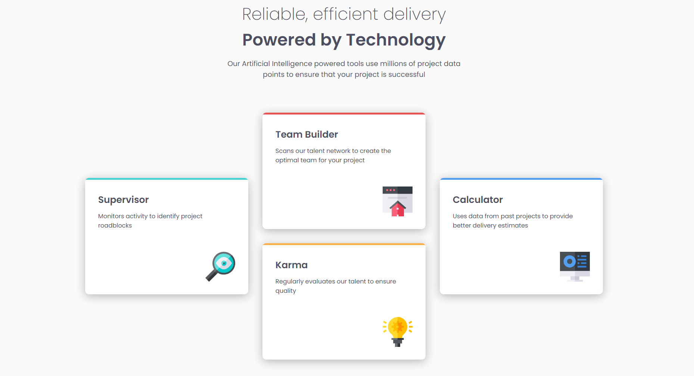
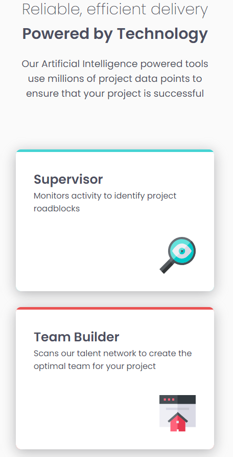
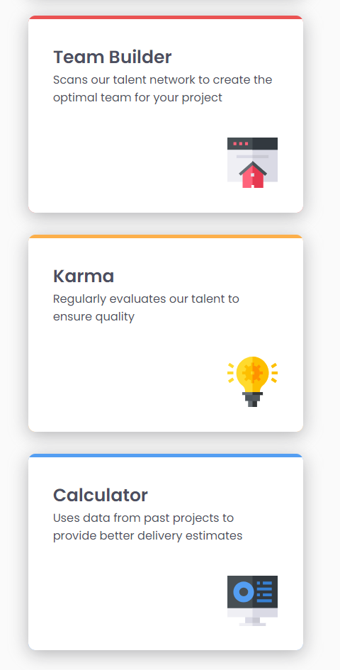

# Frontend Mentor - Four card feature section solution

This is a solution to the [Four card feature section challenge on Frontend Mentor](https://www.frontendmentor.io/challenges/four-card-feature-section-weK1eFYK). Frontend Mentor challenges help you improve your coding skills by building realistic projects. 

## Table of contents

- [Overview](#overview)
  - [The challenge](#the-challenge)
  - [Screenshot](#screenshot)
  - [Links](#links)
- [My process](#my-process)
  - [Built with](#built-with)
- [Author](#author)

## Overview

### The challenge

Users should be able to:

- View the optimal layout for the site depending on their device's screen size

### Screenshot

### Links

- Solution URL: [https://github.com/Ljubo6/four-card-feature-section](https://github.com/Ljubo6/four-card-feature-section)
- Live Site URL: [https://ljubo6.github.io/four-card-feature-section/(https://ljubo6.github.io/four-card-feature-section/)

## My process

### Built with

- Semantic HTML5 markup
- CSS custom properties
- Flexbox
- CSS Grid
- Mobile-first workflow

## Author

- Website - [https://github.com/Ljubo6/four-card-feature-section](https://github.com/Ljubo6/four-card-feature-section)
- Frontend Mentor - [@Ljubo6](https://www.frontendmentor.io/profile/@Ljubo6)
- Twitter - [@ljubo7788](https://www.twitter.com/@ljubo7788)

